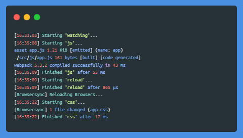

# gulp-webpack-starter
It provides a quick way to get started with a simple front-end project.



## Features
* Compiles Sass to CSS
* Compiles JavaScript with [Webpack](https://webpack.js.org/ "Webpack module bundler")
* Converts modern JavaScript (ES6+) to ES5 using [Babel](https://babeljs.io/ "Babel compiler")
* Adds vendor prefixes to CSS using [Autoprefixer](https://github.com/postcss/autoprefixer "Autoprefixer")
* Writes CSS and JavaScript source maps
* Optimizes CSS and JavaScript for production
* Runs a web server ([Browsersync](https://browsersync.io/ "Browsersync")) for CSS injection and auto-refreshing

## Usage
```bash
git clone
cd
npm install
npm run dev
```
In order to build the project for production, run:
```bash
npm run prod
```

## Notes
* No config files with paths to assets needed.
* Separate webpack configurations for each environment ([recommended](https://webpack.js.org/guides/production/ "Webpack documentation")).
* If you delete watched folder, watching task fails due to EPERM error:
```
Error: EPERM: operation not permitted, watch
    at FSEvent.FSWatcher._handle.onchange (internal/fs/watchers.js:127:28)
```  
To skip it silently, use `{ignorePermissionErrors: true}` option when calling [`watch()`](https://gulpjs.com/docs/en/api/watch#options "Gulp API watch() options").
* This array of globs copies empty `scss` and `js` folders without their contents.
```
['src/**/*', '!src/{scss,js}/**/*']
```
To prevent empty folders from being copied, you have to explicitly ignore them too:
```
['src/**/*', '!src/{scss,js}', '!src/{scss,js}/**/*']
```
* To specify which events will be watched, you can use the [`events`](https://gulpjs.com/docs/en/getting-started/watching-files#watched-events "Gulp watched events") option when calling `watch()`. By default, the watcher executes tasks whenever a file is created, changed, or deleted.
* If you use external library (e.g. [Bourbon](https://www.bourbon.io/ "Bourbon - Sass mixins library")), consider passing the `includePaths` option to [gulp-sass](https://github.com/dlmanning/gulp-sass#options "Sass plugin for Gulp"). Sass compiler will use these paths to find files from your `@import` declarations.
* Inspired by [foundation-zurb-template](https://github.com/foundation/foundation-zurb-template "ZURB Template").
